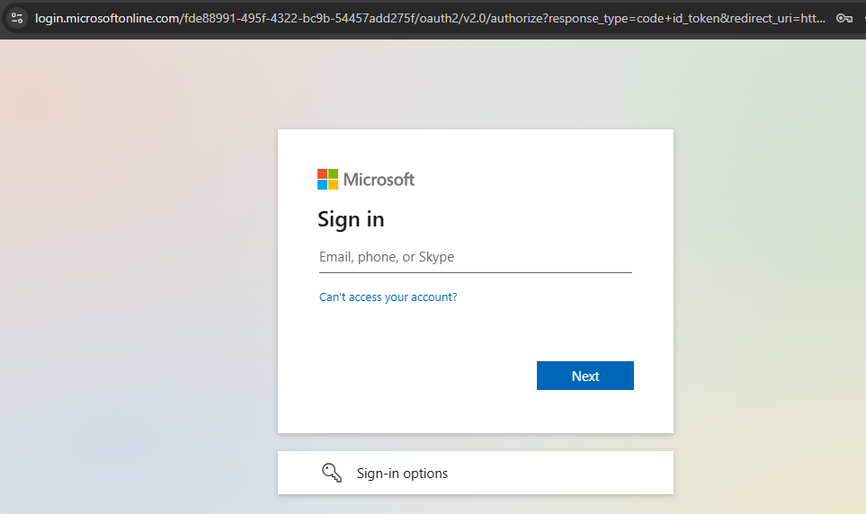
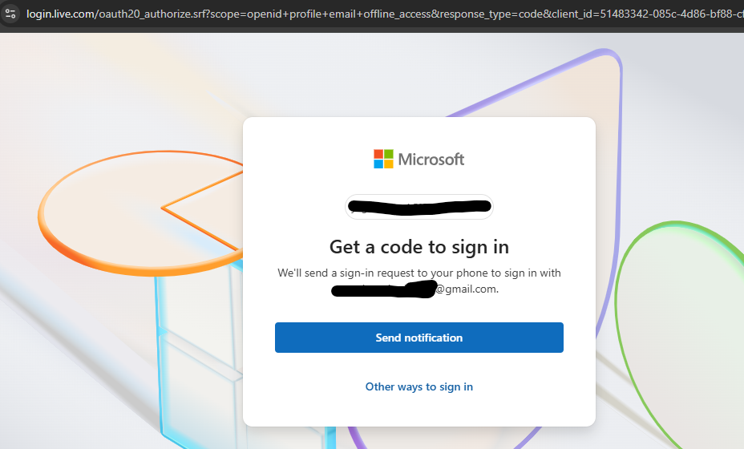
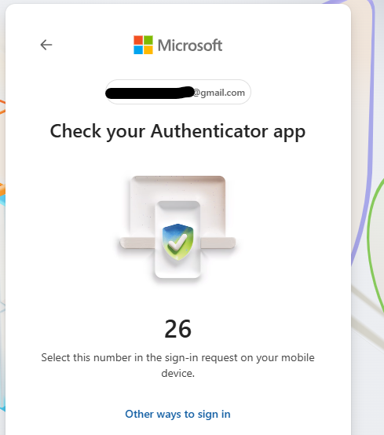
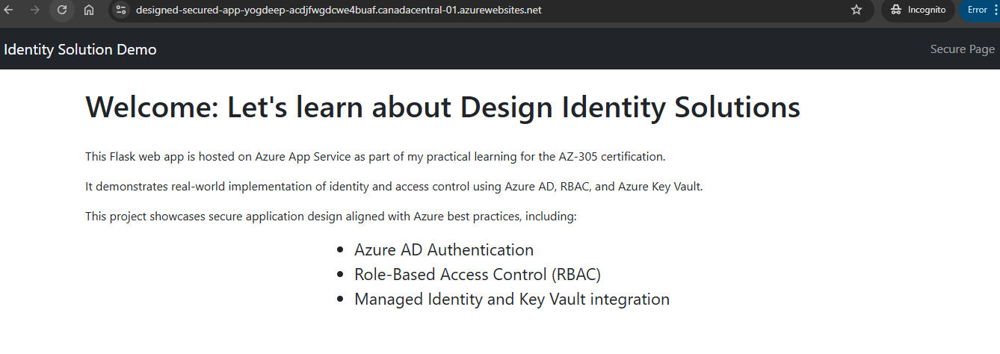
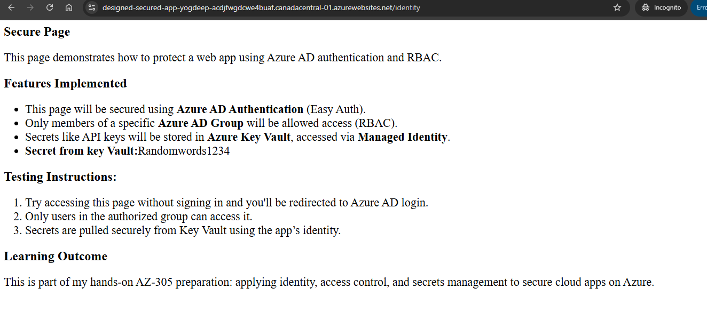

# Secure Flask Web App on Azure with Azure AD, RBAC, and Key Vault
 This is a secure Flask web app deployed to Azure App Service using GitHub integration. This project demonstrates identity and access management using Azure Active Directory, App Roles, RBAC, and Key Vault aligned with best practices for cloud security and Az-305 design principles.

## Features 
- Flask app deployed on Azure App Service
- Microsoft Azure AD login
- Role-based access using App Roles and Azure AD Groups
- Secure secret access via Azure Key Vault
- GitHub intergration for CI/CD

## Tech Stack 
- Python (Flask)
- Azure App Service
- Azure AD (Authentication & App Roles)
- Azure Key Vault
- GitHub for version control and deployment

## CMD to run app locally 
-  `pip install -r requirements.txt`
-  `python app.py`

## Steps to configure Azure Resources 
  ### Create App Services
   1. **Azure App Service**: Create on the Azure portal and link to the GitHub repo
   2. **Startup Command**: `gunicorn --bind=0.0.0.0 --timeout 600 app:app`
   3. **Identity**: Enabled System Assigned Managed Identity for the App Service.
  ### Azure AD Authentication Setup 
   1. Go to Azure App Service > Authentication
       - Enable Authentication
       - Add Microsoft Identity provider (Azure AD)
       - Link your app registration
  ### Role-Based Access Control 
   1. Create Azure AD group - `CloudEngineer` 
   2. Add the user to this group 
   3. Grant the Contributor role to this group
  ### App Role Assignment 
   1. Created app roles on the service principal and added a group to grant them access to the app
   2. Go to Enterprise applications>Find your app>Under Users and groups, click Add user/group>Select the AppAccessGroup>Assign the AppUser role.
  ### Azure Key Vault Setup 
   1. Assign `Key Vault Secrets User/Key Vault Crypto Officer` to App's Managed Identity
   2. Create a Key Vault > Add Secrets 
   3. Secure page is pulling secret password from Key Vault

### Demo of App

- **URL:** designed-secured-app-yogdeep-acdjfwgdcwe4buaf.canadacentral-01.azurewebsites.net

- **Authentication:**

- **App Screenshot**

       

    